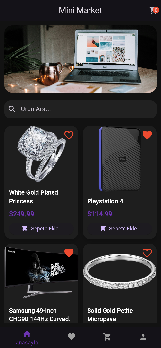
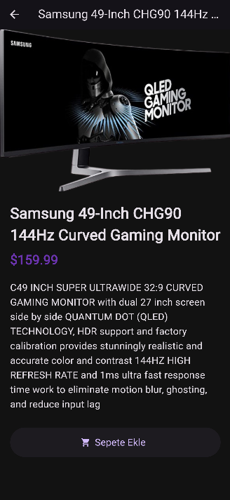
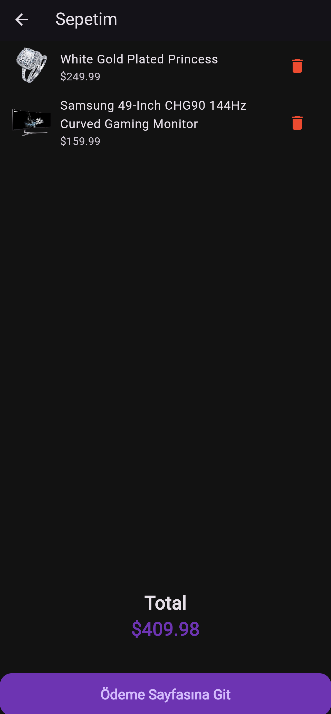

# Mini Katalog Mağazası

Flutter eğitimi kapsamında geliştirilmiş modern bir Flutter mini katalog uygulamasıdır.

---

## Özellikler

- Ürün listeleme
- Ürün detay sayfası
- Favoriler sistemi
- Alışveriş sepeti
- Sepet toplam tutarı
- Ödemeye geç butonu
- Alt navigasyon menüsü
- Modern kullanıcı arayüzü tasarımı
- Arama özelliği

---

## Kullanılan Teknolojiler

- Flutter
- Dart

---

## Flutter Sürümü

```bash
Tools • Dart 3.11.5 • DevTools 2.54.2
```

---

## Proje Yapısı

```txt
lib/
 ├── data/
 ├── models/
 ├── pages/
 ├── widgets/
```

---

## Kurulum

1. Repoyu klonlayın

```bash
git clone [YOUR_GITHUB_URL](https://github.com/yusufkc28/mini_catalog_store)
```

2. Gerekli paketleri yükleyin

```bash
flutter pub get
```

3. Uygulamayı çalıştırın

```bash
flutter run
```

---

## Ekran Görüntüleri

### Ana Sayfa



### Detay Sayfası



### Sepet Sayfası



### Favoriler Sayfası


### Profil Sayfası


